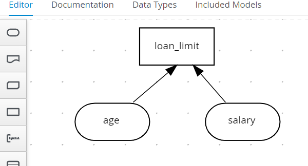
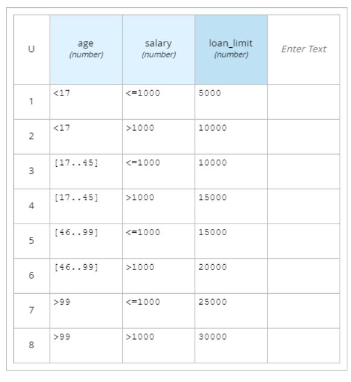

# About this Repo

A Decision Model and Notation (DMN) application, running on top of Kogito and Quarkus. 

How To
------------

Run the app
 ```
 $ mvn quarkus:dev -s settings.xml
 ```

Build by using mvn
 ```
 $ mvn clean package -s settings.xml
 ```

Test using CURL
 ```
 $ curl -X POST 'http://localhost:8080/Validation' -H 'Accept: application/json' \
        -H 'Content-Type: application/json' \
         -d '{ "age": 15, "salary": 100 }'
 
{"loan_limit":5000,"salary":100,"age":15}
 ```

Screenshots
------------




Test Cases
------------
```java
    @Test
    public void testAge15AndSalary100_loanLimit5000() {
        given()
                .body("{ \"age\": 15, \"salary\": 100 }")
                .contentType(ContentType.JSON)
                .when()
                .post("/Validation")
                .then()
                .statusCode(200)
                .body("'loan_limit'", is(5000));
    }
```

Libraries
------------
- Java 11
- Quarkus 2.15.2.Final
- Kogito 1.24.0.Final